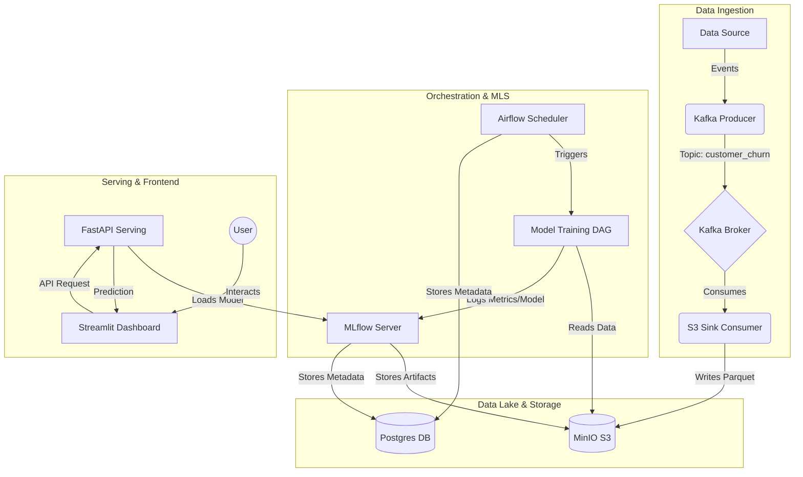

# Customer Churn Prediction System

An end-to-end Machine Learning Operations (MLOps) platform designed to predict customer churn in real-time. This system integrates modern data engineering and data science tools to provide a robust, scalable, and automated solution for identifying at-risk customers.

## 🚀 Key Features

*   **Real-time Data Ingestion**: Uses **Apache Kafka** to stream customer data events.
*   **Scalable Data Lake**: Leverages **MinIO** (S3-compatible) for robust object storage of raw data and model artifacts.
*   **Automated Orchestration**: **Apache Airflow** manages complex workflows, including data validation, model retraining, and deployment.
*   **Experiment Tracking & Registry**: **MLflow** tracks model experiments, parameters, and metrics, and serves as a central model registry.
*   **Model Serving**: A high-performance **FastAPI** application serves the best-performing models via REST API.
*   **Interactive Dashboard**: A user-friendly **Streamlit** dashboard for visualizing churn predictions and customer insights.
*   **Containerized Architecture**: Fully Dockerized environment for consistent deployment across different infrastructures.

## architecture

The system follows a microservices architecture orchestrated by Docker Compose:



## 🛠️ Tech Stack

*   **Language**: Python 3.10+
*   **Orchestration**: Apache Airflow
*   **ML Platform**: MLflow
*   **Data Streaming**: Apache Kafka, Zookeeper
*   **Storage**: MinIO (S3), PostgreSQL
*   **API Framework**: FastAPI
*   **Frontend**: Streamlit
*   **Containerization**: Docker, Docker Compose

## 📂 Project Structure

```bash
├── airflow/               # Airflow DAGs and configuration
│   └── dags/              # Workflow definitions (e.g., retraining logic)
├── data/                  # Local data directory (mapped to containers)
├── mlflow/                # MLflow Dockerfile and config
├── scripts/               # Helper scripts (db init, data inspection)
├── src/                   # Source code
│   ├── dashboard/         # Streamlit application
│   ├── ingestion/         # Producer and Consumer scripts
│   ├── models/            # Model training scripts
│   ├── serving/           # FastAPI application
│   └── utils/             # Shared utilities
├── docker-compose.yml     # Main infrastructure definition
├── .env                   # Environment variables (credentials)
└── requirements.txt       # Python dependencies
```

## 📋 Prerequisites

Ensure you have the following installed on your machine:
*   [Docker Desktop](https://www.docker.com/products/docker-desktop/) (includes Docker Compose)
*   [Git](https://git-scm.com/)

## ⚡ Quick Start

### 1. Clone the Repository
```bash
git clone https://github.com/your-username/customer-churn-prediction.git
cd customer-churn-prediction
```

### 2. Configure Environment
Create a `.env` file in the root directory. You can use the provided template or copy the following:

```ini
# Database
POSTGRES_USER=postgres
POSTGRES_PASSWORD=password

# Airflow
AIRFLOW__CORE__FERNET_KEY=eUcUh_81H-U8G4Ll-hoPmao3-sNsslqd-1xyMdpBbYQ=
AIRFLOW_ADMIN_USER=admin
AIRFLOW_ADMIN_PASSWORD=admin

# MLflow
MLFLOW_TRACKING_URI=http://localhost:5000

# MinIO
MINIO_ROOT_USER=minioadmin
MINIO_ROOT_PASSWORD=minioadmin

# Kafka
KAFKA_BOOTSTRAP_SERVERS=localhost:9092
KAFKA_BOOTSTRAP_SERVERS_INTERNAL=kafka:29092
```

### 3. Launch Services
Start the entire stack using Docker Compose:

```bash
docker-compose up -d --build
```
*Note: The first run may take a few minutes to pull images and build containers.*

### 4. Verify Installation
Check if all containers are running:
```bash
docker-compose ps
```

## 🖥️ Accessing Services

| Service | URL | Credentials (Default) |
| :--- | :--- | :--- |
| **Streamlit Dashboard** | `http://localhost:8501` | N/A |
| **Airflow Webserver** | `http://localhost:8081` | `admin` / `admin` |
| **MLflow UI** | `http://localhost:5000` | N/A |
| **MinIO Console** | `http://localhost:9001` | `minioadmin` / `minioadmin` |
| **FastAPI Docs** | `http://localhost:8000/docs` | N/A |

## 🏃‍♀️ How to Run Workflows

### 1. Data Ingestion
The system automatically starts the `producer` and `consumer` services.
*   **Producer**: Simulates data by reading `customer_churn.csv` and sending messages to Kafka.
*   **Consumer**: Reads from Kafka and saves Parquet files to the MinIO bucket `churn-lake`.

To inspect the raw data in MinIO:
1.  Open MinIO Console (`http://localhost:9001`).
2.  Login with `minioadmin` / `minioadmin`.
3.  Navigate to the `churn-lake` bucket.

### 2. Model Training & Retraining
You can trigger model training manually or via Airflow.

**Via Airflow (Recommended):**
1.  Access Airflow at `http://localhost:8081`.
2.  Login with `admin` / `admin`.
3.  Locate the `churn_retraining_dag`.
4.  Toggle the DAG to **Unpause**.
5.  Click the **Trigger DAG** (Play button) to start a run manually.
6.  Monitor the steps: `check_data` -> `train_model` -> `register_model`.

**Checking Results:**
*   Go to MLflow UI (`http://localhost:5000`) to visualize the experiment run, metrics (Accuracy, F1-Score), and artifacts.

### 3. Making Predictions
1.  Open the **Streamlit Dashboard** at `http://localhost:8501`.
2.  Use the sidebar to input customer details (Credit Score, Geography, Age, etc.).
3.  The dashboard communicates with the **FastAPI** service (`serving` container).
4.  View the prediction result (Churn Probability) and interpretation.

## 🛠️ Development & Debugging

**Useful Commands:**
*   **Stop and Remove Containers**:
    ```bash
    docker-compose down -v
    ```
*   **View Logs**:
    ```bash
    docker-compose logs -f [service_name]
    # Example: docker-compose logs -f dashboard
    ```
*   **Inspect MinIO Data Script**:
    Run the helper script to verify data in the bucket:
    ```bash
    python scripts/inspect_minio_data.py
    ```

**Project Directories:**
*   `src/dashboard`: Contains the Streamlit app code.
*   `src/serving`: Contains the FastAPI app code.
*   `src/models`: Contains training logic.
*   `airflow/dags`: Contains DAG definitions.

## 🤝 Contributing
1.  Fork the repository.
2.  Create a feature branch (`git checkout -b feature/AmazingFeature`).
3.  Commit your changes (`git commit -m 'Add some AmazingFeature'`).
4.  Push to the branch (`git push origin feature/AmazingFeature`).
5.  Open a Pull Request.

---
**License**
Distributed under the MIT License. See `LICENSE` for more information.
